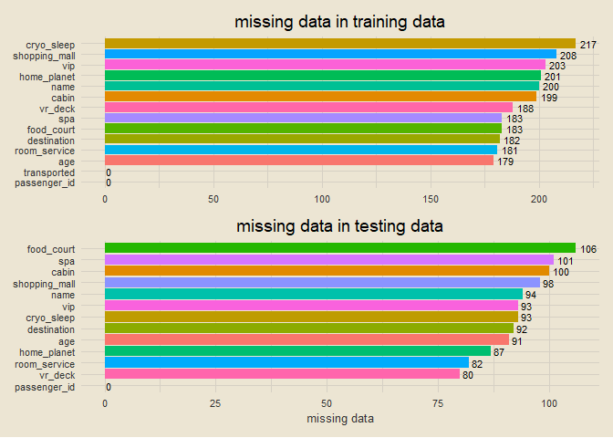
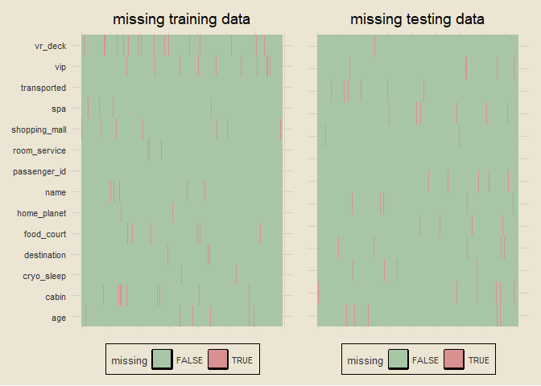
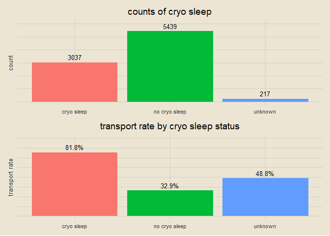
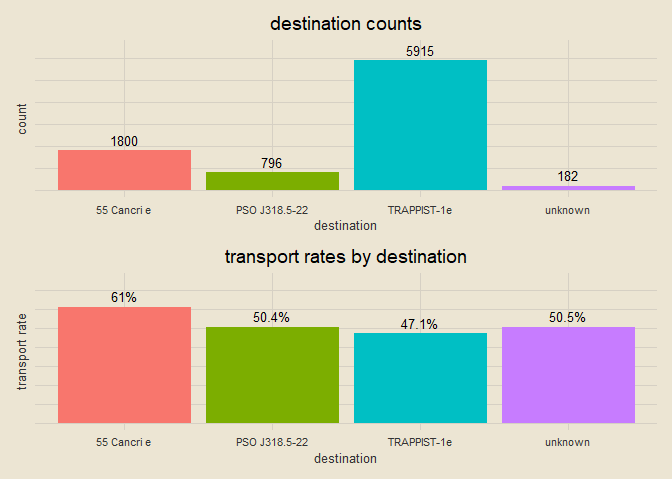

spaceship titanic
================

*IN PROGRESS*

### setup

``` r
library(tidyverse)
library(tidymodels)
library(tvthemes)
library(janitor)
library(patchwork)

theme_custom = theme_avatar() +
  theme(plot.title = element_text(hjust = 0.5),
        panel.grid.major = element_line(linewidth = 0.5, colour = "#D6D0C4"),
        panel.grid.minor = element_line(linewidth = 0.5, colour = "#D6D0C4"))

theme_set(theme_custom)
```

### data import

``` r
train = clean_names(read_csv("train.csv", col_types = cols()))
test = clean_names(read_csv("test.csv", col_types = cols()))
paste0("training data: ", nrow(train), " rows, ", ncol(train), " columns")
```

    ## [1] "training data: 8693 rows, 14 columns"

``` r
paste0("testing data: ", nrow(test), " rows, ", ncol(test), " columns")
```

    ## [1] "testing data: 4277 rows, 13 columns"

### finding missing data

``` r
train_NA = data.frame(names(train), colSums(is.na(train))) |>
  magrittr::set_colnames(c("var", "n")) |>
  ggplot(aes(reorder(var, n), n)) +
  geom_col(aes(fill = var), show.legend = F) +
  geom_text(aes(label = n), hjust = -0.25, size = 3) +
  coord_flip() +
  labs(x = NULL, y = NULL, title = "missing data in training data")

test_NA = data.frame(names(test), colSums(is.na(test))) |>
  magrittr::set_colnames(c("var", "n")) |>
  ggplot(aes(reorder(var, n), n)) +
  geom_col(aes(fill = var), show.legend = F) +
  geom_text(aes(label = n), hjust = -0.25, size = 3) +
  coord_flip() +
  labs(x = NULL, y = "missing data", title = "missing data in testing data")

train_NA / test_NA
```

<!-- -->

### visualizing where missing values occur

``` r
train_NA = data.frame(is.na(train)) |>
  mutate(id = 1:nrow(train)) |>
  pivot_longer(!id) |>
  ggplot(aes(name, id)) +
  geom_tile(aes(fill = value)) +
  scale_fill_manual(values = c("#A8C6A5", "#DA9090")) +
  coord_flip() +
  labs(x = NULL, y = NULL, title = "missing training data", fill = "missing") +
  theme(axis.text.x = element_blank())

test_NA = data.frame(is.na(test)) |>
  mutate(id = 1:nrow(test)) |>
  pivot_longer(!id) |>
  ggplot(aes(name, id)) +
  geom_tile(aes(fill = value)) +
  scale_fill_manual(values = c("#A8C6A5", "#DA9090")) +
  coord_flip() +
  theme(axis.text.y = element_blank()) +
  labs(x = NULL, y = NULL, title = "missing testing data", fill = "missing") +
  theme(axis.text.x = element_blank())

train_NA + test_NA
```

<!-- -->

### exploring `home_planet`

``` r
train = train |>
  mutate(home_planet = ifelse(is.na(home_planet), "Unknown", home_planet),
         transported = ifelse(transported == T, 1, 0))

hp_counts = train |>
  count(home_planet) |>
  ggplot(aes(home_planet, n)) +
  geom_col(aes(fill = home_planet), show.legend = F) +
  geom_text(aes(label = n), size = 3.5, vjust = -0.5) +
  labs(x = NULL, y = "count", title = "home planet counts") +
  theme(axis.text.y = element_blank()) +
  coord_cartesian(ylim = c(0, 5000))

hp_rates = train |>
  group_by(home_planet) |>
  summarise(pct = round(mean(transported), 3)) |>
  mutate(pct_lab = paste0(pct * 100, "%")) |>
  ggplot(aes(home_planet, pct)) +
  geom_col(aes(fill = home_planet), show.legend = F) +
  geom_text(aes(label = pct_lab), size = 3.5, vjust = -0.5) +
  labs(x = NULL, y = "transport rate", title = "home planet transport rates") +
  theme(axis.text.y = element_blank()) +
  coord_cartesian(ylim = c(0, 0.75))

hp_counts / hp_rates
```

<!-- -->

### exploring `cryo_sleep`

``` r
train = train |>
  mutate(cryo_sleep = case_when(cryo_sleep == T ~ "cryo sleep",
                                cryo_sleep == F ~ "no cryo sleep",
                                is.na(cryo_sleep) ~ "unknown"))

cryo_count = train |>
  count(cryo_sleep) |>
  ggplot(aes(cryo_sleep, n)) +
  geom_col(aes(fill = cryo_sleep), show.legend = F) +
  geom_text(aes(label = n), size = 3.5, vjust = -0.5) +
  labs(x = NULL, y = "count", title = "counts of cryo sleep") +
  theme(axis.text.y = element_blank()) +
  coord_cartesian(ylim = c(0, 6000))

cryo_rate = train |>
  group_by(cryo_sleep) |>
  summarise(pct = round(sum(transported) / n(), 3)) |>
  mutate(lab = paste0(pct * 100, "%")) |>
  ggplot(aes(cryo_sleep, pct)) +
  geom_col(aes(fill = cryo_sleep), show.legend = F) +
  geom_text(aes(label = lab), size = 3.5, vjust = -0.5) +
  labs(x = NULL, y = "transport rate", title = "transport rate by cryo sleep status") +
  theme(axis.text.y = element_blank()) +
  coord_cartesian(ylim = c(0, 1))

cryo_count / cryo_rate
```

<!-- -->

### separating `cabin` into `cabin_x` and `cabin_y`

``` r
train = train |>
  separate(cabin, into = c("cabin1", "cabin2", "cabin3"), sep = "/") |>
  select(-cabin2) |>
  rename(cabin_x = cabin1, cabin_y = cabin3) |>
  mutate(cabin_x = ifelse(is.na(cabin_x), "other", cabin_x),
         cabin_y = ifelse(is.na(cabin_y), "other", cabin_y))

train |>
  select(cabin_x, cabin_y) |>
  sample_n(5)
```

    ## # A tibble: 5 x 2
    ##   cabin_x cabin_y
    ##   <chr>   <chr>  
    ## 1 G       S      
    ## 2 G       P      
    ## 3 D       P      
    ## 4 F       P      
    ## 5 B       P

### exploring `cabin_x`

``` r
cx_count = train |>
  count(cabin_x) |>
  ggplot(aes(cabin_x, n)) +
  geom_col(aes(fill = cabin_x), show.legend = F) +
  geom_text(aes(label = n), size = 3, vjust = -0.5) +
  labs(x = NULL, y = "count", title = "counts of cabin_x") +
  theme(axis.text.y = element_blank()) +
  coord_cartesian(ylim = c(0, 3000))

cx_rate = train |>
  group_by(cabin_x) |>
  summarise(pct = round(sum(transported) / n(), 3)) |>
  mutate(lab = paste0(pct * 100, "%")) |>
  ggplot(aes(cabin_x, pct)) +
  geom_col(aes(fill = cabin_x), show.legend = F) +
  geom_text(aes(label = lab), size = 3, vjust = -0.5) +
  labs(y = "transport rate", title = "transport rates by cabin_x") +
  theme(axis.text.y = element_blank()) +
  coord_cartesian(ylim = c(0, 0.8))

cx_count / cx_rate
```

<!-- -->

### moving `cabin_x` level *T* to level *other* (low frequency)

``` r
train = train |>
  mutate(cabin_x = ifelse(cabin_x == "T", "other", cabin_x))

cx_count = train |>
  count(cabin_x) |>
  ggplot(aes(cabin_x, n)) +
  geom_col(aes(fill = cabin_x), show.legend = F) +
  geom_text(aes(label = n), size = 3, vjust = -0.5) +
  labs(x = NULL, y = "count", title = "counts of cabin_x") +
  theme(axis.text.y = element_blank()) +
  coord_cartesian(ylim = c(0, 3000))

cx_rate = train |>
  group_by(cabin_x) |>
  summarise(pct = round(sum(transported) / n(), 3)) |>
  mutate(lab = paste0(pct * 100, "%")) |>
  ggplot(aes(cabin_x, pct)) +
  geom_col(aes(fill = cabin_x), show.legend = F) +
  geom_text(aes(label = lab), size = 3, vjust = -0.5) +
  labs(y = "transport rate", title = "transport rates by cabin_x") +
  theme(axis.text.y = element_blank()) +
  coord_cartesian(ylim = c(0, 0.8))

cx_count / cx_rate
```

<!-- -->

### exploring `cabin_y`

``` r
cy_count = train |>
  count(cabin_y) |>
  ggplot(aes(cabin_y, n)) +
  geom_col(aes(fill = cabin_y), show.legend = F) +
  geom_text(aes(label = n), size = 3, vjust = -0.5) +
  labs(x = NULL, y = "count", title = "counts of cabin_y") +
  theme(axis.text.y = element_blank()) +
  coord_cartesian(ylim = c(0, 4500))

cy_rate = train |>
  group_by(cabin_y) |>
  summarise(pct = round(sum(transported) / n(), 3)) |>
  mutate(lab = paste0(pct * 100, "%")) |>
  ggplot(aes(cabin_y, pct)) +
  geom_col(aes(fill = cabin_y), show.legend = F) +
  geom_text(aes(label = lab), size = 3, vjust = -0.5) +
  labs(y = "transport rate", title = "transport rates by cabin_y") +
  theme(axis.text.y = element_blank()) +
  coord_cartesian(ylim = c(0, 0.7))

cy_count / cy_rate
```

<!-- -->

### exploring `destination`

``` r
train = train |>
  mutate(destination = ifelse(is.na(destination), "unknown", destination))

dest_count = train |>
  count(destination) |>
  ggplot(aes(destination, n)) +
  geom_col(aes(fill = destination), show.legend = F) +
  geom_text(aes(label = n), size = 3.5, vjust = -0.5) +
  labs(x = "destination", y = "count", title = "destination counts") +
  theme(axis.text.y = element_blank()) +
  coord_cartesian(ylim = c(0, 6500))

dest_rate = train |>
  group_by(destination) |>
  summarise(pct = round(sum(transported) / n(), 3)) |>
  mutate(lab = paste0(pct * 100, "%")) |>
  ggplot(aes(destination, pct)) +
  geom_col(aes(fill = destination), show.legend = F) +
  geom_text(aes(label = lab), size = 3.5, vjust = -0.5) +
  labs(y = "transport rate", title = "transport rates by destination") +
  theme(axis.text.y = element_blank()) +
  coord_cartesian(ylim = c(0, 0.75))

dest_count / dest_rate
```

<!-- -->

### exploring `age`

``` r
train |>
  filter(!is.na(age)) |>
  ggplot(aes(age)) +
  geom_histogram(bins = 25, fill = "#A3BBA0", col = "black") +
  labs(x = "age", y = "count", title = "histogram of age",
       subtitle = "slightly right-skewed; will impute missing data with median") +
  theme(plot.subtitle = element_text(hjust = 0.5, size = 9, face = "italic", vjust = 2.75))
```

<!-- -->

### replacing missing `age` values & creating `age_group`

``` r
train = train |>
  mutate(age = ifelse(is.na(age), median(train$age, na.rm = T), age))

age_scat = train |>
  group_by(age) |>
  summarise(pct = sum(transported) / n(),
            n = n()) |>
  ggplot(aes(age, pct)) +
  geom_point(aes(size = n), col = "#A191A6") +
  labs(y = "transport rate", size = "count", title = "transport rate by age")

age_cut = train |>
  mutate(age_group = cut_number(age, n = 5)) |>
  group_by(age_group) |>
  summarise(pct = round(sum(transported) / n(), 3),
            n = n()) |>
  mutate(lab = paste0(pct * 100, "%")) |>
  ggplot(aes(age_group, pct)) +
  geom_col(aes(fill = age_group), show.legend = F) +
  geom_text(aes(label = lab), size = 3.5, vjust = -0.5) +
  labs(x = "age group", y = NULL, title = "transport rate by age group") +
  theme(axis.text.y = element_blank()) +
  coord_cartesian(ylim = c(0, 0.7))

age_scat + age_cut
```

<!-- -->

### xxx

``` r
train |>
  mutate(vip = case_when(vip == T ~ "vip",
                         vip == F ~ "non-vip",
                         is.na(vip) ~ "unknown")) |>
  group_by(vip) |>
  summarise(pct = round(sum(transported) / n(), 3),
            n = n()) |>
  ggplot(aes(vip, pct)) +
  geom_col()
```

<!-- -->
