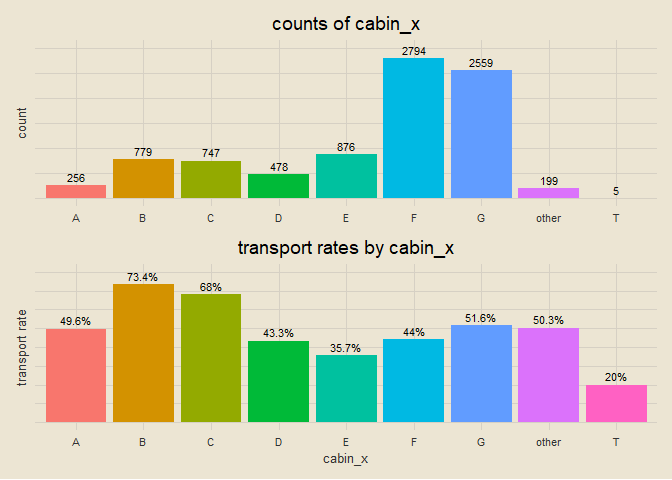
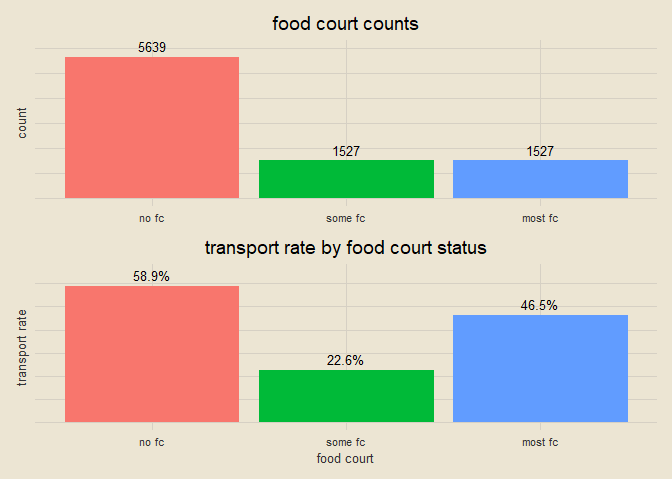
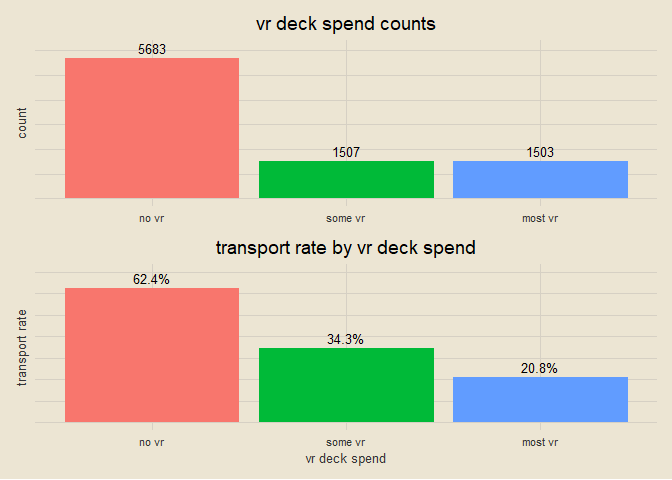

spaceship titanic
================

### setup

``` r
tictoc::tic()

library(tidyverse)
library(tidymodels)
library(tvthemes)
library(janitor)
library(patchwork)
library(vip)

theme_custom = theme_avatar() +
  theme(plot.title = element_text(hjust = 0.5),
        panel.grid.major = element_line(linewidth = 0.5, colour = "#D6D0C4"),
        panel.grid.minor = element_line(linewidth = 0.5, colour = "#D6D0C4"))

theme_set(theme_custom)
```

### data import

``` r
train = clean_names(read_csv("train.csv", col_types = cols()))
test = clean_names(read_csv("test.csv", col_types = cols()))
paste0("training data: ", nrow(train), " rows, ", ncol(train), " columns")
```

    ## [1] "training data: 8693 rows, 14 columns"

``` r
paste0("testing data: ", nrow(test), " rows, ", ncol(test), " columns")
```

    ## [1] "testing data: 4277 rows, 13 columns"

### finding missing data

``` r
train_NA = data.frame(names(train), colSums(is.na(train))) |>
  magrittr::set_colnames(c("var", "n")) |>
  ggplot(aes(reorder(var, n), n)) +
  geom_col(aes(fill = var), show.legend = F) +
  geom_text(aes(label = n), hjust = -0.25, size = 3) +
  coord_flip() +
  labs(x = NULL, y = NULL, title = "missing data in training data")

test_NA = data.frame(names(test), colSums(is.na(test))) |>
  magrittr::set_colnames(c("var", "n")) |>
  ggplot(aes(reorder(var, n), n)) +
  geom_col(aes(fill = var), show.legend = F) +
  geom_text(aes(label = n), hjust = -0.25, size = 3) +
  coord_flip() +
  labs(x = NULL, y = "missing data", title = "missing data in testing data")

train_NA / test_NA
```

<!-- -->

### visualizing where missing values occur

``` r
train_NA = data.frame(is.na(train)) |>
  mutate(id = 1:nrow(train)) |>
  pivot_longer(!id) |>
  ggplot(aes(name, id)) +
  geom_tile(aes(fill = value)) +
  scale_fill_manual(values = c("#A8C6A5", "#DA9090")) +
  coord_flip() +
  labs(x = NULL, y = NULL, title = "missing training data", fill = "missing") +
  theme(axis.text.x = element_blank())

test_NA = data.frame(is.na(test)) |>
  mutate(id = 1:nrow(test)) |>
  pivot_longer(!id) |>
  ggplot(aes(name, id)) +
  geom_tile(aes(fill = value)) +
  scale_fill_manual(values = c("#A8C6A5", "#DA9090")) +
  coord_flip() +
  theme(axis.text.y = element_blank()) +
  labs(x = NULL, y = NULL, title = "missing testing data", fill = "missing") +
  theme(axis.text.x = element_blank())

train_NA + test_NA
```

<!-- -->

``` r
rm(train_NA, test_NA)
```

### exploring `home_planet`

``` r
train = train |>
  mutate(home_planet = ifelse(is.na(home_planet), "Unknown", home_planet),
         transported = ifelse(transported == T, 1, 0))

test = test |>
  mutate(home_planet = ifelse(is.na(home_planet), "Unknown", home_planet))

hp_counts = train |>
  count(home_planet) |>
  ggplot(aes(home_planet, n)) +
  geom_col(aes(fill = home_planet), show.legend = F) +
  geom_text(aes(label = n), size = 3.5, vjust = -0.5) +
  labs(x = NULL, y = "count", title = "home planet counts") +
  theme(axis.text.y = element_blank()) +
  coord_cartesian(ylim = c(0, 5000))

hp_rates = train |>
  group_by(home_planet) |>
  summarise(pct = round(mean(transported), 3)) |>
  mutate(pct_lab = paste0(pct * 100, "%")) |>
  ggplot(aes(home_planet, pct)) +
  geom_col(aes(fill = home_planet), show.legend = F) +
  geom_text(aes(label = pct_lab), size = 3.5, vjust = -0.5) +
  labs(x = NULL, y = "transport rate", title = "home planet transport rates") +
  theme(axis.text.y = element_blank()) +
  coord_cartesian(ylim = c(0, 0.75))

hp_counts / hp_rates
```

<!-- -->

``` r
rm(hp_counts, hp_rates)
```

### exploring `cryo_sleep`

``` r
train = train |>
  mutate(cryo_sleep = case_when(cryo_sleep == T ~ "cryo sleep",
                                cryo_sleep == F ~ "no cryo sleep",
                                is.na(cryo_sleep) ~ "unknown"))

test = test |>
  mutate(cryo_sleep = case_when(cryo_sleep == T ~ "cryo sleep",
                                cryo_sleep == F ~ "no cryo sleep",
                                is.na(cryo_sleep) ~ "unknown"))

cryo_count = train |>
  count(cryo_sleep) |>
  ggplot(aes(cryo_sleep, n)) +
  geom_col(aes(fill = cryo_sleep), show.legend = F) +
  geom_text(aes(label = n), size = 3.5, vjust = -0.5) +
  labs(x = NULL, y = "count", title = "counts of cryo sleep") +
  theme(axis.text.y = element_blank()) +
  coord_cartesian(ylim = c(0, 6000))

cryo_rate = train |>
  group_by(cryo_sleep) |>
  summarise(pct = round(sum(transported) / n(), 3)) |>
  mutate(lab = paste0(pct * 100, "%")) |>
  ggplot(aes(cryo_sleep, pct)) +
  geom_col(aes(fill = cryo_sleep), show.legend = F) +
  geom_text(aes(label = lab), size = 3.5, vjust = -0.5) +
  labs(x = NULL, y = "transport rate", title = "transport rate by cryo sleep status") +
  theme(axis.text.y = element_blank()) +
  coord_cartesian(ylim = c(0, 1))

cryo_count / cryo_rate
```

<!-- -->

``` r
rm(cryo_count, cryo_rate)
```

### separating `cabin` into `cabin_x` and `cabin_y`

``` r
train = train |>
  separate(cabin, into = c("cabin1", "cabin2", "cabin3"), sep = "/") |>
  select(-cabin2) |>
  rename(cabin_x = cabin1, cabin_y = cabin3) |>
  mutate(cabin_x = ifelse(is.na(cabin_x), "other", cabin_x),
         cabin_y = ifelse(is.na(cabin_y), "other", cabin_y))

test = test |>
  separate(cabin, into = c("cabin1", "cabin2", "cabin3"), sep = "/") |>
  select(-cabin2) |>
  rename(cabin_x = cabin1, cabin_y = cabin3) |>
  mutate(cabin_x = ifelse(is.na(cabin_x), "other", cabin_x),
         cabin_y = ifelse(is.na(cabin_y), "other", cabin_y))

train |>
  select(cabin_x, cabin_y) |>
  sample_n(5)
```

    ## # A tibble: 5 × 2
    ##   cabin_x cabin_y
    ##   <chr>   <chr>  
    ## 1 C       P      
    ## 2 G       S      
    ## 3 G       S      
    ## 4 G       S      
    ## 5 C       S

### exploring `cabin_x`

``` r
cx_count = train |>
  count(cabin_x) |>
  ggplot(aes(cabin_x, n)) +
  geom_col(aes(fill = cabin_x), show.legend = F) +
  geom_text(aes(label = n), size = 3, vjust = -0.5) +
  labs(x = NULL, y = "count", title = "counts of cabin_x") +
  theme(axis.text.y = element_blank()) +
  coord_cartesian(ylim = c(0, 3000))

cx_rate = train |>
  group_by(cabin_x) |>
  summarise(pct = round(sum(transported) / n(), 3)) |>
  mutate(lab = paste0(pct * 100, "%")) |>
  ggplot(aes(cabin_x, pct)) +
  geom_col(aes(fill = cabin_x), show.legend = F) +
  geom_text(aes(label = lab), size = 3, vjust = -0.5) +
  labs(y = "transport rate", title = "transport rates by cabin_x") +
  theme(axis.text.y = element_blank()) +
  coord_cartesian(ylim = c(0, 0.8))

cx_count / cx_rate
```

<!-- -->

``` r
rm(cx_count, cx_rate)
```

### moving `cabin_x` level *T* to level *other* (low frequency)

``` r
train = train |>
  mutate(cabin_x = ifelse(cabin_x == "T", "other", cabin_x))

test = test |>
  mutate(cabin_x = ifelse(cabin_x == "T", "other", cabin_x))

cx_count = train |>
  count(cabin_x) |>
  ggplot(aes(cabin_x, n)) +
  geom_col(aes(fill = cabin_x), show.legend = F) +
  geom_text(aes(label = n), size = 3, vjust = -0.5) +
  labs(x = NULL, y = "count", title = "counts of cabin_x") +
  theme(axis.text.y = element_blank()) +
  coord_cartesian(ylim = c(0, 3000))

cx_rate = train |>
  group_by(cabin_x) |>
  summarise(pct = round(sum(transported) / n(), 3)) |>
  mutate(lab = paste0(pct * 100, "%")) |>
  ggplot(aes(cabin_x, pct)) +
  geom_col(aes(fill = cabin_x), show.legend = F) +
  geom_text(aes(label = lab), size = 3, vjust = -0.5) +
  labs(y = "transport rate", title = "transport rates by cabin_x") +
  theme(axis.text.y = element_blank()) +
  coord_cartesian(ylim = c(0, 0.8))

cx_count / cx_rate
```

<!-- -->

``` r
rm(cx_count, cx_rate)
```

### exploring `cabin_y`

``` r
cy_count = train |>
  count(cabin_y) |>
  ggplot(aes(cabin_y, n)) +
  geom_col(aes(fill = cabin_y), show.legend = F) +
  geom_text(aes(label = n), size = 3, vjust = -0.5) +
  labs(x = NULL, y = "count", title = "counts of cabin_y") +
  theme(axis.text.y = element_blank()) +
  coord_cartesian(ylim = c(0, 4500))

cy_rate = train |>
  group_by(cabin_y) |>
  summarise(pct = round(sum(transported) / n(), 3)) |>
  mutate(lab = paste0(pct * 100, "%")) |>
  ggplot(aes(cabin_y, pct)) +
  geom_col(aes(fill = cabin_y), show.legend = F) +
  geom_text(aes(label = lab), size = 3, vjust = -0.5) +
  labs(y = "transport rate", title = "transport rates by cabin_y") +
  theme(axis.text.y = element_blank()) +
  coord_cartesian(ylim = c(0, 0.7))

cy_count / cy_rate
```

<!-- -->

``` r
rm(cy_count, cy_rate)
```

### exploring `destination`

``` r
train = train |>
  mutate(destination = ifelse(is.na(destination), "unknown", destination))

test = test |>
  mutate(destination = ifelse(is.na(destination), "unknown", destination))

dest_count = train |>
  count(destination) |>
  ggplot(aes(destination, n)) +
  geom_col(aes(fill = destination), show.legend = F) +
  geom_text(aes(label = n), size = 3.5, vjust = -0.5) +
  labs(x = "destination", y = "count", title = "destination counts") +
  theme(axis.text.y = element_blank()) +
  coord_cartesian(ylim = c(0, 6500))

dest_rate = train |>
  group_by(destination) |>
  summarise(pct = round(sum(transported) / n(), 3)) |>
  mutate(lab = paste0(pct * 100, "%")) |>
  ggplot(aes(destination, pct)) +
  geom_col(aes(fill = destination), show.legend = F) +
  geom_text(aes(label = lab), size = 3.5, vjust = -0.5) +
  labs(y = "transport rate", title = "transport rates by destination") +
  theme(axis.text.y = element_blank()) +
  coord_cartesian(ylim = c(0, 0.75))

dest_count / dest_rate
```

<!-- -->

``` r
rm(dest_count, dest_rate)
```

### exploring `age`

``` r
train |>
  filter(!is.na(age)) |>
  ggplot(aes(age)) +
  geom_histogram(bins = 25, fill = "#A3BBA0", col = "black") +
  labs(x = "age", y = "count", title = "histogram of age",
       subtitle = "slightly right-skewed; will impute missing data with median") +
  theme(plot.subtitle = element_text(hjust = 0.5, size = 9, face = "italic", vjust = 2.75))
```

<!-- -->

### replacing missing `age` values & creating `age_group`

``` r
train = train |>
  mutate(age = ifelse(is.na(age), median(train$age, na.rm = T), age))

test = test |>
  mutate(age = ifelse(is.na(age), median(test$age, na.rm = T), age))

age_scat = train |>
  group_by(age) |>
  summarise(pct = sum(transported) / n(),
            n = n()) |>
  ggplot(aes(age, pct)) +
  geom_point(aes(size = n), col = "#A191A6") +
  labs(y = "transport rate", size = "count", title = "transport rate by age")

train = train |>
  mutate(age = cut_number(age, n = 5))

test = test |>
  mutate(age = case_when(age >= 0 & age <= 18 ~ "[0,18]",
                         age > 18 & age <= 24 ~ "(18,24]",
                         age > 24 & age <= 30 ~ "(24,30]",
                         age > 30 & age <= 40 ~ "(30,40]",
                         age > 40 ~ "(40,79]"),
         age = factor(age, levels = c("[0,18]", "(18,24]", "(24,30]", "(30,40]", "(40,79]")))

age_cut = train |>
  group_by(age) |>
  summarise(pct = round(sum(transported) / n(), 3),
            n = n()) |>
  mutate(lab = paste0(pct * 100, "%")) |>
  ggplot(aes(age, pct)) +
  geom_col(aes(fill = age), show.legend = F) +
  geom_text(aes(label = lab), size = 3.5, vjust = -0.5) +
  labs(x = "age group", y = NULL, title = "transport rate by age group") +
  theme(axis.text.y = element_blank()) +
  coord_cartesian(ylim = c(0, 0.7))

age_scat + age_cut
```

<!-- -->

``` r
rm(age_scat, age_cut)
```

### exploring `vip`

``` r
train = train |>
  mutate(vip = case_when(vip == T ~ "vip",
                         vip == F ~ "non-vip",
                         is.na(vip) ~ "unknown")) |>
  mutate(vip = factor(vip, levels = c("vip", "non-vip", "unknown")))

test = test |>
  mutate(vip = case_when(vip == T ~ "vip",
                         vip == F ~ "non-vip",
                         is.na(vip) ~ "unknown")) |>
  mutate(vip = factor(vip, levels = c("vip", "non-vip", "unknown")))

vip_count = train |>
  count(vip) |>
  ggplot(aes(vip, n)) +
  geom_col(aes(fill = vip), show.legend = F) +
  geom_text(aes(label = n), size = 3.5, vjust = -0.5) +
  labs(x = NULL, y = "count", title = "vip status counts; heavily imbalanced") +
  theme(axis.text.y = element_blank()) +
  coord_cartesian(ylim = c(0, 9000))

vip_rate = train |>
  group_by(vip) |>
  summarise(pct = round(sum(transported) / n(), 3)) |>
  mutate(vip = factor(vip, levels = c("vip", "non-vip", "unknown")),
         lab = paste0(pct * 100, "%")) |>
  ggplot(aes(vip, pct)) +
  geom_col(aes(fill = vip), show.legend = F) +
  geom_text(aes(label = lab), size = 3.5, vjust = -0.5) +
  labs(x = "vip status", y = "transport rate", title = "transport rate by vip status") +
  theme(axis.text.y = element_blank()) +
  coord_cartesian(ylim = c(0, 0.6))

vip_count / vip_rate
```

<!-- -->

``` r
rm(vip_count, vip_rate)
```

### exploring `room_service`

``` r
nonzero_median = pull(summarise(filter(train, room_service > 0), med = median(room_service)), med)

train = train |>
  mutate(room_service = ifelse(is.na(room_service), 0, room_service),
         room_service = case_when(room_service == 0 ~ "no rs",
                              room_service > 0 & room_service <= nonzero_median ~ "less rs",
                              room_service > nonzero_median ~ "most rs"),
         room_service = factor(room_service, levels = c("no rs", "less rs", "most rs")))

nonzero_median = pull(summarise(filter(test, room_service > 0), med = median(room_service)), med)

test = test |>
  mutate(room_service = ifelse(is.na(room_service), 0, room_service),
         room_service = case_when(room_service == 0 ~ "no rs",
                              room_service > 0 & room_service <= nonzero_median ~ "less rs",
                              room_service > nonzero_median ~ "most rs"),
         room_service = factor(room_service, levels = c("no rs", "less rs", "most rs")))

rs_count = train |>
  count(room_service) |>
  ggplot(aes(room_service, n)) +
  geom_col(aes(fill = room_service), show.legend = F) +
  geom_text(aes(label = n), size = 3.5, vjust = -0.5) +
  labs(x = NULL, y = "count", title = "room service counts") +
  theme(axis.text.y = element_blank()) +
  coord_cartesian(ylim = c(0, 6100))

rs_rate = train |>
  group_by(room_service) |>
  summarise(n = n(),
            pct = round(sum(transported) / n(), 3)) |>
  mutate(lab = paste0(pct * 100, "%")) |>
  ggplot(aes(room_service, pct)) +
  geom_col(aes(fill = room_service), show.legend = F) +
  geom_text(aes(label = lab), size = 3.5, vjust = -0.5) +
  labs(x = "room service status", y = "transport rate", title = "transport rate by room service status") +
  theme(axis.text.y = element_blank()) +
  coord_cartesian(ylim = c(0, 0.7))

rs_count / rs_rate
```

<!-- -->

``` r
rm(rs_count, rs_rate)
```

### exploring `food_court`

``` r
nonzero_median = pull(summarise(filter(train, food_court > 0), med = median(food_court)), med)

train = train |>
  mutate(food_court = case_when(is.na(food_court) | food_court == 0 ~ "no fc",
                                food_court > 0 & food_court <= nonzero_median ~ "some fc",
                                food_court > nonzero_median ~ "most fc"),
         food_court = factor(food_court, levels = c("no fc", "some fc", "most fc")))

nonzero_median = pull(summarise(filter(test, food_court > 0), med = median(food_court)), med)

test = test |>
  mutate(food_court = case_when(is.na(food_court) | food_court == 0 ~ "no fc",
                                food_court > 0 & food_court <= nonzero_median ~ "some fc",
                                food_court > nonzero_median ~ "most fc"),
         food_court = factor(food_court, levels = c("no fc", "some fc", "most fc")))

fc_count = train |>
  count(food_court) |>
  ggplot(aes(food_court, n)) +
  geom_col(aes(fill = food_court), show.legend = F) +
  geom_text(aes(label = n), size = 3.5, vjust = -0.5) +
  labs(x = NULL, y = "count", title = "food court counts") +
  theme(axis.text.y = element_blank()) +
  coord_cartesian(ylim = c(0, 6000))

fc_rate = train |>
  group_by(food_court) |>
  summarise(pct = round(sum(transported) / n(), 3)) |>
  mutate(lab = paste0(pct * 100, "%")) |>
  ggplot(aes(food_court, pct)) +
  geom_col(aes(fill = food_court), show.legend = F) +
  geom_text(aes(label = lab), size = 3.5, vjust = -0.5) +
  labs(x = "food court", y = "transport rate", title = "transport rate by food court status") +
  theme(axis.text.y = element_blank()) +
  coord_cartesian(ylim = c(0, 0.65))

fc_count / fc_rate
```

<!-- -->

``` r
rm(fc_count, fc_rate)
```

### exploring `shopping_mall`

``` r
nonzero_median = pull(summarise(filter(train, shopping_mall > 0), med = median(shopping_mall), med))

train = train |>
  mutate(shopping_mall = replace_na(shopping_mall, 0),
         shopping_mall = case_when(shopping_mall == 0 ~ "no shopping",
                                shopping_mall > 0 & shopping_mall <= nonzero_median ~ "some shopping",
                                shopping_mall > nonzero_median ~ "most shopping"),
         shopping_mall = factor(shopping_mall, levels = c("no shopping", "some shopping", "most shopping")))

nonzero_median = pull(summarise(filter(test, shopping_mall > 0), med = median(shopping_mall), med))

test = test |>
  mutate(shopping_mall = replace_na(shopping_mall, 0),
         shopping_mall = case_when(shopping_mall == 0 ~ "no shopping",
                                shopping_mall > 0 & shopping_mall <= nonzero_median ~ "some shopping",
                                shopping_mall > nonzero_median ~ "most shopping"),
         shopping_mall = factor(shopping_mall, levels = c("no shopping", "some shopping", "most shopping")))

shop_count = train |>
  count(shopping_mall) |>
  ggplot(aes(shopping_mall, n)) +
  geom_col(aes(fill = shopping_mall), show.legend = F) +
  geom_text(aes(label = n), size = 3.5, vjust = -0.5) +
  labs(x = NULL, y = "count", title = "shopping mall counts") +
  theme(axis.text.y = element_blank()) +
  coord_cartesian(ylim = c(0, 6200))

shop_rate = train |>
  group_by(shopping_mall) |>
  summarise(pct = round(sum(transported) / n(), 3)) |>
  mutate(lab = paste0(pct * 100, "%")) |>
  ggplot(aes(shopping_mall, pct)) +
  geom_col(aes(fill = shopping_mall), show.legend = F) +
  geom_text(aes(label = lab), size = 3.5, vjust = -0.5) +
  labs(x = "shopping group", y = "transport rate", title = "transport rate by shopping group") +
  theme(axis.text.y = element_blank()) +
  coord_cartesian(ylim = c(0, 0.65))

shop_count / shop_rate
```

<!-- -->

``` r
rm(shop_count, shop_rate)
```

### exploring `spa`

``` r
nonzero_median = pull(summarise(filter(train, spa > 0), med = median(spa), med))

train = train |>
  mutate(spa = case_when(is.na(spa) | spa == 0 ~ "no spa",
                         spa > 0 & spa <= nonzero_median ~ "some spa",
                         spa > nonzero_median ~ "most spa"),
         spa = factor(spa, levels = c("no spa", "some spa", "most spa")))

nonzero_median = pull(summarise(filter(test, spa > 0), med = median(spa), med))

test = test |>
  mutate(spa = case_when(is.na(spa) | spa == 0 ~ "no spa",
                         spa > 0 & spa <= nonzero_median ~ "some spa",
                         spa > nonzero_median ~ "most spa"),
         spa = factor(spa, levels = c("no spa", "some spa", "most spa")))

spa_count = train |>
  count(spa) |>
  ggplot(aes(spa, n)) +
  geom_col(aes(fill = spa), show.legend = F) +
  geom_text(aes(label = n), size = 3.5, vjust = -0.5) +
  labs(x = NULL, y = "count", title = "spa spend counts") +
  theme(axis.text.y = element_blank()) +
  coord_cartesian(ylim = c(0, 6000))

spa_rate = train |>
  group_by(spa) |>
  summarise(pct = round(sum(transported) / n(), 3)) |>
  mutate(lab = paste0(pct * 100, "%")) |>
  ggplot(aes(spa, pct)) +
  geom_col(aes(fill = spa), show.legend = F) +
  geom_text(aes(label = lab), size = 3.5, vjust = -0.5) +
  labs(x = "spa spend", y = "transport rate", title = "transport rate by spa spend") +
  theme(axis.text.y = element_blank()) +
  coord_cartesian(ylim = c(0, 0.7))

spa_count / spa_rate
```

<!-- -->

``` r
rm(spa_count, spa_rate)
```

### exploring `vr_deck`

``` r
nonzero_median = pull(summarise(filter(train, vr_deck > 0), med = median(vr_deck), med))

train = train |>
  mutate(vr_deck = case_when(is.na(vr_deck) | vr_deck == 0 ~ "no vr",
                         vr_deck > 0 & vr_deck <= nonzero_median ~ "some vr",
                         vr_deck > nonzero_median ~ "most vr"),
         vr_deck = factor(vr_deck, levels = c("no vr", "some vr", "most vr")))

nonzero_median = pull(summarise(filter(test, vr_deck > 0), med = median(vr_deck), med))

test = test |>
  mutate(vr_deck = case_when(is.na(vr_deck) | vr_deck == 0 ~ "no vr",
                         vr_deck > 0 & vr_deck <= nonzero_median ~ "some vr",
                         vr_deck > nonzero_median ~ "most vr"),
         vr_deck = factor(vr_deck, levels = c("no vr", "some vr", "most vr")))

vr_deck_count = train |>
  count(vr_deck) |>
  ggplot(aes(vr_deck, n)) +
  geom_col(aes(fill = vr_deck), show.legend = F) +
  geom_text(aes(label = n), size = 3.5, vjust = -0.5) +
  labs(x = NULL, y = "count", title = "vr deck spend counts") +
  theme(axis.text.y = element_blank()) +
  coord_cartesian(ylim = c(0, 6100))

vr_deck_rate = train |>
  group_by(vr_deck) |>
  summarise(pct = round(sum(transported) / n(), 3)) |>
  mutate(lab = paste0(pct * 100, "%")) |>
  ggplot(aes(vr_deck, pct)) +
  geom_col(aes(fill = vr_deck), show.legend = F) +
  geom_text(aes(label = lab), size = 3.5, vjust = -0.5) +
  labs(x = "vr deck spend", y = "transport rate", title = "transport rate by vr deck spend") +
  theme(axis.text.y = element_blank()) +
  coord_cartesian(ylim = c(0, 0.7))

vr_deck_count / vr_deck_rate
```

<!-- -->

``` r
rm(vr_deck_count, vr_deck_rate)
```

### separating `name` into `first_name` and `last_name`

``` r
train = train |>
  mutate(name = ifelse(is.na(name), "unknown unknown", name)) |>
  separate(name, into = c("first_name", "last_name"), sep = " ")

test = test |>
  mutate(name = ifelse(is.na(name), "unknown unknown", name)) |>
  separate(name, into = c("first_name", "last_name"), sep = " ")

train |>
  select(first_name, last_name) |>
  sample_n(5)
```

    ## # A tibble: 5 × 2
    ##   first_name last_name 
    ##   <chr>      <chr>     
    ## 1 Becca      Buckentry 
    ## 2 Naffsh     Katte     
    ## 3 Alasym     Couresteer
    ## 4 Stmeal     Cre       
    ## 5 Ste        Sfin

### exploring `first_name`

``` r
first_name_classes = train |>
  group_by(first_name) |>
  summarise(n = n(),
            pct = round(sum(transported) / n(), 3)) |>
  mutate(class = case_when(n >= 3 & pct >= 0.5 ~ "high freq, high rate",
                           n >= 3 & pct < 0.5 ~ "high freq, low rate",
                           first_name == "unknown" | n < 3 ~ "low freq / unknown"),
         class = factor(class, levels = c("high freq, high rate", "high freq, low rate", "low freq / unknown"))) |>
  select(first_name, first_name_class = class)

train = train |>
  left_join(first_name_classes, by = "first_name")

hf_hr = train |> filter(first_name_class == "high freq, high rate") |> pull(first_name) |> unique()
hf_lr = train |> filter(first_name_class == "high freq, low rate") |> pull(first_name) |> unique()
lf = train |> filter(first_name_class == "low freq / unknown") |> pull(first_name) |> unique()

train = train |>
  select(-first_name)

test = test |>
  mutate(first_name_class = case_when(first_name %in% hf_hr ~ "high freq, high rate",
                                      first_name %in% hf_lr ~ "high freq, low rate",
                                      first_name %in% lf |
                                      !first_name %in% c(hf_hr, hf_lr, lf) ~ "low freq / unknown")) |>
  select(-first_name)

first_count = train |>
  count(first_name_class) |>
  ggplot(aes(first_name_class, n)) +
  geom_col(aes(fill = first_name_class), show.legend = F) +
  geom_text(aes(label = n), size = 3.5, vjust = -0.5) +
  labs(x = NULL, y = "count", title = "first name class counts") +
  theme(axis.text.y = element_blank()) +
  coord_cartesian(ylim = c(0, 4500))

first_rate = train |>
  group_by(first_name_class) |>
  summarise(pct = round(sum(transported) / n(), 3)) |>
  mutate(lab = paste0(pct * 100, "%")) |>
  ggplot(aes(first_name_class, pct)) +
  geom_col(aes(fill = first_name_class), show.legend = F) +
  geom_text(aes(label = lab), size = 3.5, vjust = -0.5) +
  labs(x = "first name class", y = "transport rate", title = "transport rate by first name class") +
  theme(axis.text.y = element_blank()) +
  coord_cartesian(ylim = c(0, 0.75))

first_count / first_rate
```

<!-- -->

``` r
rm(first_name_classes, first_count, first_rate)
```

### exploring `last_name`

``` r
last_name_classes = train |>
  group_by(last_name) |>
  summarise(n = n(),
            pct = round(sum(transported) / n(), 3)) |>
  mutate(class = case_when(n >= 3 & pct >= 0.5 ~ "high freq / rate",
                           n >= 3 & pct < 0.5 ~ "high freq, low rate",
                           n < 3 | last_name == "unknown" ~ "low freq / unknown"),
         class = factor(class, levels = c("high freq / rate", "high freq, low rate", "low freq / unknown"))) |>
  select(last_name, last_name_class = class)

train = train |>
  left_join(last_name_classes, by = "last_name")

hf_hr = train |> filter(last_name_class == "high freq / rate") |> pull(last_name) |> unique()
hf_lr = train |> filter(last_name_class == "high freq, low rate") |> pull(last_name) |> unique()
lf = train |> filter(last_name_class == "low freq / unknown") |> pull(last_name) |> unique()

train = train |>
  select(-last_name)

test = test |>
  mutate(last_name_class = case_when(last_name %in% hf_hr ~ "high freq / rate",
                                      last_name %in% hf_lr ~ "high freq, low rate",
                                      last_name %in% lf |
                                      !last_name %in% c(hf_hr, hf_lr, lf) ~ "low freq / unknown")) |>
  select(-last_name)

last_count = train |>
  count(last_name_class) |>
  ggplot(aes(last_name_class, n)) +
  geom_col(aes(fill = last_name_class), show.legend = F) +
  geom_text(aes(label = n), size = 3.5, vjust = -0.5) +
  labs(x = NULL, y = "count", title = "last name class counts") +
  theme(axis.text.y = element_blank()) +
  coord_cartesian(ylim = c(0, 4500))

last_rate = train |>
  group_by(last_name_class) |>
  summarise(pct = round(sum(transported) / n(), 3)) |>
  mutate(lab = paste0(pct * 100, "%")) |>
  ggplot(aes(last_name_class, pct)) +
  geom_col(aes(fill = last_name_class), show.legend = F) +
  geom_text(aes(label = lab), size = 3.5, vjust = -0.5) +
  labs(x = "last name class", y = "transport rate", title = "transport rate by last name class") +
  theme(axis.text.y = element_blank()) +
  coord_cartesian(ylim = c(0, 0.75))

last_count / last_rate
```

<!-- -->

``` r
rm(last_name_classes, last_count, last_rate, nonzero_median, hf_hr, hf_lr, lf)
```

### changing `transported` labels for modeling

``` r
train = train |>
  mutate(transported = ifelse(transported == 1, "transported", "not transported"))

train |>
  count(transported)
```

    ## # A tibble: 2 × 2
    ##   transported         n
    ##   <chr>           <int>
    ## 1 not transported  4315
    ## 2 transported      4378

### data splitting

``` r
split = initial_split(train, prop = 0.75, strata = transported)
train_data = training(split)
test_data = testing(split)

paste0("training dimensions: ", nrow(train_data), " rows, ", ncol(train_data), " columns")
```

    ## [1] "training dimensions: 6519 rows, 16 columns"

``` r
paste0("testing dimensions: ", nrow(test_data), " rows, ", ncol(test_data), " columns")
```

    ## [1] "testing dimensions: 2174 rows, 16 columns"

### creating recipes

``` r
model_recipe = recipe(transported ~ ., data = train_data) |>
  update_role(passenger_id, new_role = "ID") |>
  step_string2factor(all_nominal()) |>
  step_rm(passenger_id)

xgb_recipe = recipe(transported ~ ., data = train_data) |>
  update_role(passenger_id, new_role = "ID") |>
  step_rm(passenger_id) |>
  step_dummy(all_predictors())

xgb_recipe |>
  prep() |>
  bake(train_data)
```

    ## # A tibble: 6,519 × 38
    ##    transported   home_…¹ home_…² home_…³ cryo_…⁴ cryo_…⁵ cabin…⁶ cabin…⁷ cabin…⁸
    ##    <fct>           <dbl>   <dbl>   <dbl>   <dbl>   <dbl>   <dbl>   <dbl>   <dbl>
    ##  1 not transpor…       1       0       0       1       0       1       0       0
    ##  2 not transpor…       1       0       0       1       0       0       0       0
    ##  3 not transpor…       0       1       0       1       0       0       0       0
    ##  4 not transpor…       0       0       0       1       0       0       0       0
    ##  5 not transpor…       0       0       0       0       0       0       0       0
    ##  6 not transpor…       0       0       0       0       0       0       0       0
    ##  7 not transpor…       0       0       0       0       0       0       0       0
    ##  8 not transpor…       0       0       0       0       0       0       0       0
    ##  9 not transpor…       0       0       0       1       0       0       0       0
    ## 10 not transpor…       0       1       0       1       0       0       0       1
    ## # … with 6,509 more rows, 29 more variables: cabin_x_E <dbl>, cabin_x_F <dbl>,
    ## #   cabin_x_G <dbl>, cabin_x_other <dbl>, cabin_y_P <dbl>, cabin_y_S <dbl>,
    ## #   destination_PSO.J318.5.22 <dbl>, destination_TRAPPIST.1e <dbl>,
    ## #   destination_unknown <dbl>, age_X.18.24. <dbl>, age_X.24.30. <dbl>,
    ## #   age_X.30.40. <dbl>, age_X.40.79. <dbl>, vip_non.vip <dbl>,
    ## #   vip_unknown <dbl>, room_service_less.rs <dbl>, room_service_most.rs <dbl>,
    ## #   food_court_some.fc <dbl>, food_court_most.fc <dbl>, …

### creating cross-validation folds

``` r
train_data = mutate(train_data, transported = factor(transported))
cv_folds = vfold_cv(train_data, v = 5, strata = transported)
cv_folds
```

    ## #  5-fold cross-validation using stratification 
    ## # A tibble: 5 × 2
    ##   splits              id   
    ##   <list>              <chr>
    ## 1 <split [5214/1305]> Fold1
    ## 2 <split [5215/1304]> Fold2
    ## 3 <split [5215/1304]> Fold3
    ## 4 <split [5216/1303]> Fold4
    ## 5 <split [5216/1303]> Fold5

### specifying logistic regression model

``` r
log_spec = logistic_reg() |>
  set_engine(engine = "glm") |>
  set_mode("classification")

log_spec
```

    ## Logistic Regression Model Specification (classification)
    ## 
    ## Computational engine: glm

### specifying random forest model

``` r
rf_spec = rand_forest() |>
  set_engine("ranger", importance = "impurity") |>
  set_mode("classification")

rf_spec
```

    ## Random Forest Model Specification (classification)
    ## 
    ## Engine-Specific Arguments:
    ##   importance = impurity
    ## 
    ## Computational engine: ranger

### specifying xgboost model

``` r
xgb_spec = boost_tree() |>
  set_engine("xgboost", eval_metric = "logloss") |>
  set_mode("classification")

xgb_spec
```

    ## Boosted Tree Model Specification (classification)
    ## 
    ## Engine-Specific Arguments:
    ##   eval_metric = logloss
    ## 
    ## Computational engine: xgboost

### specifying k-nearest neighbors model

``` r
knn_spec = nearest_neighbor(neighbors = 5) |>
  set_engine("kknn") |>
  set_mode("classification")

knn_spec
```

    ## K-Nearest Neighbor Model Specification (classification)
    ## 
    ## Main Arguments:
    ##   neighbors = 5
    ## 
    ## Computational engine: kknn

### creating model workflows (doing all in one code chunk)

``` r
log_wf = workflow() |>
  add_recipe(model_recipe) |>
  add_model(log_spec)

rf_wf = workflow() |>
  add_recipe(model_recipe) |>
  add_model(rf_spec)

xgb_wf = workflow() |>
  add_recipe(xgb_recipe) |>
  add_model(xgb_spec)

knn_wf = workflow() |>
  add_recipe(model_recipe) |>
  add_model(knn_spec)

xgb_wf
```

    ## ══ Workflow ════════════════════════════════════════════════════════════════════
    ## Preprocessor: Recipe
    ## Model: boost_tree()
    ## 
    ## ── Preprocessor ────────────────────────────────────────────────────────────────
    ## 2 Recipe Steps
    ## 
    ## • step_rm()
    ## • step_dummy()
    ## 
    ## ── Model ───────────────────────────────────────────────────────────────────────
    ## Boosted Tree Model Specification (classification)
    ## 
    ## Engine-Specific Arguments:
    ##   eval_metric = logloss
    ## 
    ## Computational engine: xgboost

### getting logistic regression results

``` r
log_res = log_wf |>
  fit_resamples(resamples = cv_folds,
                metrics = metric_set(accuracy),
                control = control_resamples(save_pred = T))

collect_metrics(log_res)
```

    ## # A tibble: 1 × 6
    ##   .metric  .estimator  mean     n std_err .config             
    ##   <chr>    <chr>      <dbl> <int>   <dbl> <chr>               
    ## 1 accuracy binary     0.812     5 0.00488 Preprocessor1_Model1

### getting random forest results

``` r
rf_res = rf_wf |>
  fit_resamples(resamples = cv_folds,
                metrics = metric_set(accuracy),
                control = control_resamples(save_pred = T))

collect_metrics(rf_res)
```

    ## # A tibble: 1 × 6
    ##   .metric  .estimator  mean     n std_err .config             
    ##   <chr>    <chr>      <dbl> <int>   <dbl> <chr>               
    ## 1 accuracy binary     0.819     5 0.00425 Preprocessor1_Model1

### getting xgboost results

``` r
xgb_res = xgb_wf |>
  fit_resamples(resamples = cv_folds,
                metrics = metric_set(accuracy),
                control = control_resamples(save_pred = T))

collect_metrics(xgb_res)
```

    ## # A tibble: 1 × 6
    ##   .metric  .estimator  mean     n std_err .config             
    ##   <chr>    <chr>      <dbl> <int>   <dbl> <chr>               
    ## 1 accuracy binary     0.813     5 0.00421 Preprocessor1_Model1

### getting knn results

``` r
knn_res = knn_wf |>
  fit_resamples(resamples = cv_folds,
                metrics = metric_set(accuracy),
                control = control_resamples(save_pred = T))

collect_metrics(knn_res)
```

    ## # A tibble: 1 × 6
    ##   .metric  .estimator  mean     n std_err .config             
    ##   <chr>    <chr>      <dbl> <int>   <dbl> <chr>               
    ## 1 accuracy binary     0.753     5 0.00227 Preprocessor1_Model1

### restarting modeling process with random forest in mind

``` r
split = initial_split(train, prop = 0.75, strata = transported)
train_data = training(split)
test_data = testing(split)

paste0("training data: ", nrow(train_data), " observations; test data: ", nrow(test_data), " observations")
```

    ## [1] "training data: 6519 observations; test data: 2174 observations"

### building model recipe

``` r
mod_rec = recipe(transported ~ ., data = train_data) |>
  update_role(passenger_id, new_role = "ID") |>
  step_string2factor(all_nominal())

train_prep = prep(mod_rec)
juiced = juice(train_prep)

sample_n(juiced, 10)
```

    ## # A tibble: 10 × 16
    ##    passeng…¹ home_…² cryo_…³ cabin_x cabin_y desti…⁴ age   vip   room_…⁵ food_…⁶
    ##    <fct>     <fct>   <fct>   <fct>   <fct>   <fct>   <fct> <fct> <fct>   <fct>  
    ##  1 6480_01   Earth   no cry… E       S       TRAPPI… (24,… non-… most rs some fc
    ##  2 2594_01   Europa  cryo s… B       S       TRAPPI… (30,… non-… no rs   no fc  
    ##  3 6085_01   Earth   no cry… F       P       TRAPPI… (40,… non-… no rs   no fc  
    ##  4 8780_01   Earth   no cry… G       S       TRAPPI… (24,… non-… no rs   some fc
    ##  5 1550_01   Europa  no cry… C       S       TRAPPI… (24,… non-… less rs some fc
    ##  6 1767_03   Europa  no cry… C       S       TRAPPI… (30,… non-… most rs most fc
    ##  7 7527_01   Earth   no cry… F       P       TRAPPI… [0,1… non-… no rs   most fc
    ##  8 5290_01   Earth   no cry… F       P       TRAPPI… (30,… non-… most rs some fc
    ##  9 7843_01   Mars    cryo s… other   other   TRAPPI… (40,… non-… no rs   no fc  
    ## 10 3305_01   Mars    cryo s… D       P       TRAPPI… (30,… non-… no rs   no fc  
    ## # … with 6 more variables: shopping_mall <fct>, spa <fct>, vr_deck <fct>,
    ## #   first_name_class <fct>, last_name_class <fct>, transported <fct>, and
    ## #   abbreviated variable names ¹​passenger_id, ²​home_planet, ³​cryo_sleep,
    ## #   ⁴​destination, ⁵​room_service, ⁶​food_court

### building tunable model specification

``` r
tune_spec = rand_forest(trees = 1000, mtry = tune(), min_n = tune()) |>
  set_mode("classification") |>
  set_engine("ranger")

tune_spec
```

    ## Random Forest Model Specification (classification)
    ## 
    ## Main Arguments:
    ##   mtry = tune()
    ##   trees = 1000
    ##   min_n = tune()
    ## 
    ## Computational engine: ranger

### creating modeling workflow

``` r
tune_wf = workflow() |>
  add_recipe(mod_rec) |>
  add_model(tune_spec)

tune_wf
```

    ## ══ Workflow ════════════════════════════════════════════════════════════════════
    ## Preprocessor: Recipe
    ## Model: rand_forest()
    ## 
    ## ── Preprocessor ────────────────────────────────────────────────────────────────
    ## 1 Recipe Step
    ## 
    ## • step_string2factor()
    ## 
    ## ── Model ───────────────────────────────────────────────────────────────────────
    ## Random Forest Model Specification (classification)
    ## 
    ## Main Arguments:
    ##   mtry = tune()
    ##   trees = 1000
    ##   min_n = tune()
    ## 
    ## Computational engine: ranger

### creating cross-validation folds and tuning

``` r
cv_folds = vfold_cv(train_data, v = 5)
doParallel::registerDoParallel()
tune_res = tune_grid(tune_wf, resamples = cv_folds, grid = 25)
```

    ## i Creating pre-processing data to finalize unknown parameter: mtry

``` r
tune_res
```

    ## # Tuning results
    ## # 5-fold cross-validation 
    ## # A tibble: 5 × 4
    ##   splits              id    .metrics          .notes          
    ##   <list>              <chr> <list>            <list>          
    ## 1 <split [5215/1304]> Fold1 <tibble [50 × 6]> <tibble [0 × 3]>
    ## 2 <split [5215/1304]> Fold2 <tibble [50 × 6]> <tibble [0 × 3]>
    ## 3 <split [5215/1304]> Fold3 <tibble [50 × 6]> <tibble [0 × 3]>
    ## 4 <split [5215/1304]> Fold4 <tibble [50 × 6]> <tibble [0 × 3]>
    ## 5 <split [5216/1303]> Fold5 <tibble [50 × 6]> <tibble [0 × 3]>

### viewing tuning results

``` r
tune_res |>
  collect_metrics() |>
  filter(.metric == "accuracy") |>
  slice_max(mean, n = 5)
```

    ## # A tibble: 5 × 8
    ##    mtry min_n .metric  .estimator  mean     n std_err .config              
    ##   <int> <int> <chr>    <chr>      <dbl> <int>   <dbl> <chr>                
    ## 1     4    21 accuracy binary     0.823     5 0.00440 Preprocessor1_Model23
    ## 2     8    25 accuracy binary     0.823     5 0.00436 Preprocessor1_Model02
    ## 3     9    37 accuracy binary     0.823     5 0.00499 Preprocessor1_Model10
    ## 4     5    22 accuracy binary     0.823     5 0.00385 Preprocessor1_Model20
    ## 5     7    37 accuracy binary     0.823     5 0.00424 Preprocessor1_Model25

### visualizing model tuning results

``` r
tune_res |>
  collect_metrics() |>
  filter(.metric == "accuracy") |>
  mutate(mtry = factor(mtry),
         min_n = factor(min_n)) |>
  ggplot(aes(mtry, min_n)) +
  geom_point(aes(col = mean), size = 4) +
  geom_text(aes(label = round(mean, 3)), size = 3, hjust = -0.4, vjust = 0.3) +
  scale_color_gradient(high = "springgreen4", low = "indianred3") +
  labs(title = "model tuning results")
```

<!-- -->

### finalizing model specification with best tuning results

``` r
best_acc = select_best(tune_res, "accuracy")
final_rf = finalize_model(tune_spec, best_acc)
final_rf
```

    ## Random Forest Model Specification (classification)
    ## 
    ## Main Arguments:
    ##   mtry = 4
    ##   trees = 1000
    ##   min_n = 21
    ## 
    ## Computational engine: ranger

### variable importance

``` r
final_rf |>
  set_engine("ranger", importance = "permutation") |>
  fit(transported ~ ., data = juiced |> select(-passenger_id)) |>
  vip(geom = "point")
```

<!-- -->

### final workflow

``` r
final_wf = workflow() |>
  add_recipe(mod_rec) |>
  add_model(final_rf)

final_res = final_wf |>
  last_fit(split)

final_res |>
  collect_metrics()
```

    ## # A tibble: 2 × 4
    ##   .metric  .estimator .estimate .config             
    ##   <chr>    <chr>          <dbl> <chr>               
    ## 1 accuracy binary         0.817 Preprocessor1_Model1
    ## 2 roc_auc  binary         0.896 Preprocessor1_Model1

### fitting model on all training data

``` r
mod_rec = recipe(transported ~ ., data = train) |>
  update_role(passenger_id, new_role = "ID") |>
  step_string2factor(all_nominal())

train_prep = prep(mod_rec)
juiced = juice(train_prep)

predictions = final_rf |>
  set_engine("ranger", importance = "permutation") |>
  fit(transported ~ ., data = juiced |> select(-passenger_id)) |>
  predict(new_data = test)

predictions |>
  bind_cols(test) |>
  select(PassengerId = passenger_id,
         Transported = .pred_class) |>
  mutate(Transported = ifelse(Transported == "transported", "True", "False")) |>
  write_csv("kaggle_submission.csv")
```

### script runtime

``` r
tictoc::toc()
```

    ## 254.89 sec elapsed
